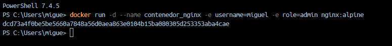
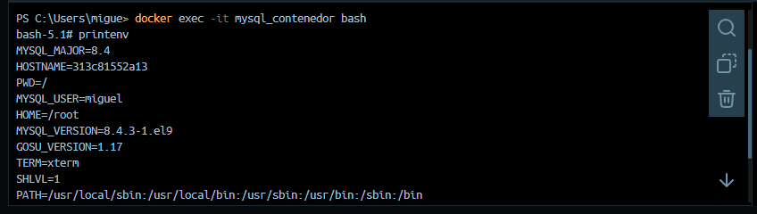
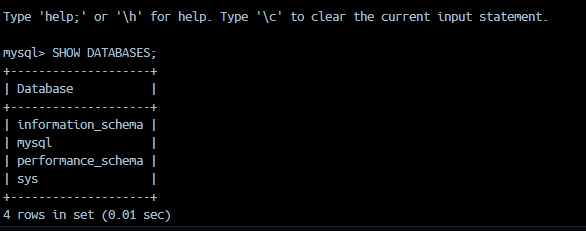

# Variables de Entorno
### ¿Qué son las variables de entorno?
# COMPLETAR
Las variables de entorno son variables almacenadas en el sistema operativo que contienen valores globales accesibles por los programas y scripts en ejecución. Estas variables son clave en muchos sistemas y aplicaciones, ya que permiten configurar y ajustar el comportamiento del software sin necesidad de modificar el código fuente.

### Para crear un contenedor con variables de entorno?

```
docker run -d --name <nombre contenedor> -e <nombre variable1>=<valor1> -e <nombre variable2>=<valor2>
```

### Crear un contenedor a partir de la imagen de nginx:alpine con las siguientes variables de entorno: username y role. Para la variable de entorno rol asignar el valor admin.

# COMPLETAR
```
docker run -d --name contenedor_nginx -e username=miguel -e role=admin nginx:alpine
```

# CAPTURA CON LA COMPROBACIÓN DE LA CREACIÓN DE LAS VARIABLES DE ENTORNO DEL CONTENEDOR ANTERIOR

### Crear un contenedor con mysql:8 , mapear todos los puertos
# COMPLETAR
```
docker run -d --name contenedor_mysql -P mysql:8
```

### ¿El contenedor se está ejecutando?
# COMPLETAR
No se está ejecutando.
```
PS C:\Users\migue> docker ps
CONTAINER ID   IMAGE          COMMAND                  CREATED       STATUS         PORTS     NAMES
dcd73a4f0be5   nginx:alpine   "/docker-entrypoint.…"   4 hours ago   Up 3 minutes   80/tcp    contenedor_nginx
```

### Identificar el problema
# COMPLETAR
En la declaración de la línea de comando para crear el contenedor MYSQL:8, no se especificó cuál es la variable de entorno; por lo tanto, no se ejecuta el contenedor.
```
docker run -d --name contenedor_mysql -e MYSQL_ROOT_PASSWORD=admin123 -P mysql:8
```

### Eliminar el contenedor creado con mysql:8 
# COMPLETAR
```
docker rm contenedor_mysql
```

### Para crear un contenedor con variables de entorno especificadas
- Portabilidad: Las aplicaciones se vuelven más portátiles y pueden ser desplegadas en diferentes entornos (desarrollo, pruebas, producción) simplemente cambiando el archivo de variables de entorno.
- Centralización: Todas las configuraciones importantes se centralizan en un solo lugar, lo que facilita la gestión y auditoría de las configuraciones.
- Consistencia: Asegura que todos los miembros del equipo de desarrollo o los entornos de despliegue utilicen las mismas configuraciones.
- Evitar Exposición en el Código: Mantener variables sensibles como contraseñas, claves API, y tokens fuera del código fuente reduce el riesgo de exposición accidental a través del control de versiones.
- Control de Acceso: Los archivos de variables de entorno pueden ser gestionados con permisos específicos, limitando quién puede ver o modificar la configuración sensible.

Previo a esto es necesario crear el archivo y colocar las variables en un archivo, **.env** se ha convertido en una convención estándar, pero también es posible usar cualquier extensión como **.txt**.
```
docker run -d --name <nombre contenedor> --env-file=<nombreArchivo>.<extensión> <nombre imagen>
```
**Considerar**
Es necesario especificar la ruta absoluta del archivo si este se encuentra en una ubicación diferente a la que estás ejecutando el comando docker run.

### Crear un contenedor con mysql:8 , mapear todos los puertos y configurar las variables de entorno mediante un archivo
# COMPLETAR
```
docker run -P -d --name mysql_contenedor --env-file=C:\Users\migue\Desktop\varables_entorno.txt mysql:8
```

# CAPTURA CON LA COMPROBACIÓN DE LA CREACIÓN DE LAS VARIABLES DE ENTORNO DEL CONTENEDOR ANTERIOR 


### ¿Qué bases de datos existen en el contenedor creado?
En el contenedor de MySQL creado, existen las siguientes bases de datos:
- **information_schema:** Contiene información sobre todas las demás bases de datos y sus objetos (tablas, columnas, etc.).
- **mysql:** Base de datos que almacena los datos de usuario y privilegios de acceso.
- **performance_schema:** Proporciona información sobre el rendimiento del servidor MySQL y estadísticas sobre la ejecución de las consultas.
- **sys:** Una base de datos que facilita el acceso a las estadísticas de rendimiento y configuración del servidor.
# COMPLETAR

