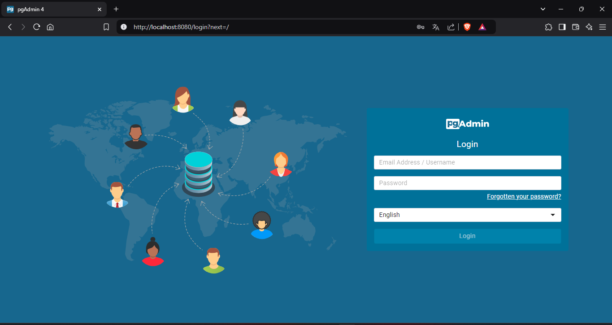
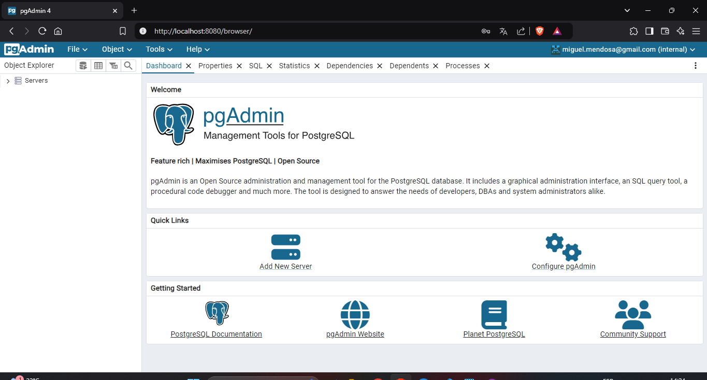
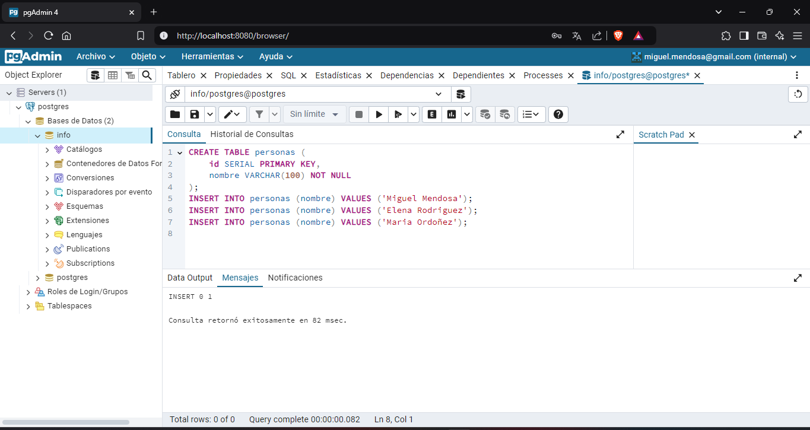
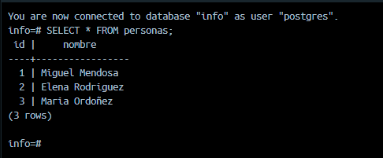

### Crear contenedor de Postgres sin que exponga los puertos. Usar la imagen: postgres:11.21-alpine3.17
# COMPLETAR
```
docker run -d --name contenedor_postgres -e POSTGRES_PASSWORD=admin123 postgres:11.21-alpine3.17
```
### Crear un cliente de postgres. Usar la imagen: dpage/pgadmin4

# COMPLETAR
```
docker run -d --name cliente_postgres -e PGADMIN_DEFAULT_EMAIL=miguel.mendosa@gmail.com -e PGADMIN_DEFAULT_PASSWORD=admin -p 8080:80 dpage/pgadmin4
```
La figura presenta el esquema creado en donde los puertos son:
- a: (completar con el valor)
- b: (completar con el valor)
- c: (completar con el valor)


## Desde el cliente
### Acceder desde el cliente al servidor postgres creado.
# COMPLETAR CON UNA CAPTURA DEL LOGIN


### Crear la base de datos info, y dentro de esa base la tabla personas, con id (serial) y nombre (varchar), agregar un par de registros en la tabla, obligatorio incluir su nombre.

```
CREATE TABLE personas (
    id SERIAL PRIMARY KEY,
    nombre VARCHAR(100) NOT NULL
);

INSERT INTO personas (nombre) VALUES ('Miguel Mendosa');
INSERT INTO personas (nombre) VALUES ('Elena Rodriguez');
INSERT INTO personas (nombre) VALUES ('Maria Ordoñez');
```
## Desde el servidor postgresl
### Acceder al servidor
```
docker exec -it contenedor_postgres psql -U postgres
```
### Conectarse a la base de datos info
# COMPLETAR
```
\c info
```
### Realizar un select *from personas
# AGREGAR UNA CAPTURA DE PANTALLA DEL RESULTADO
