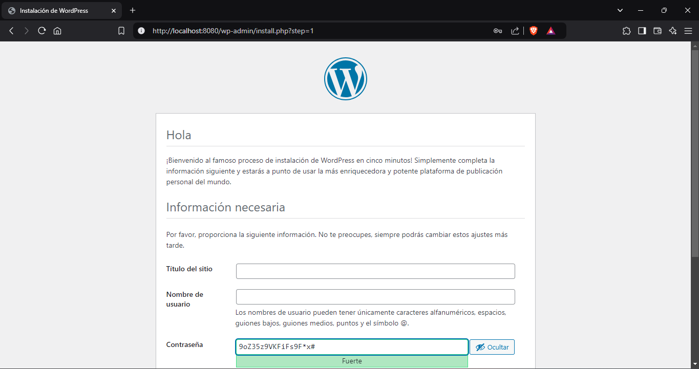
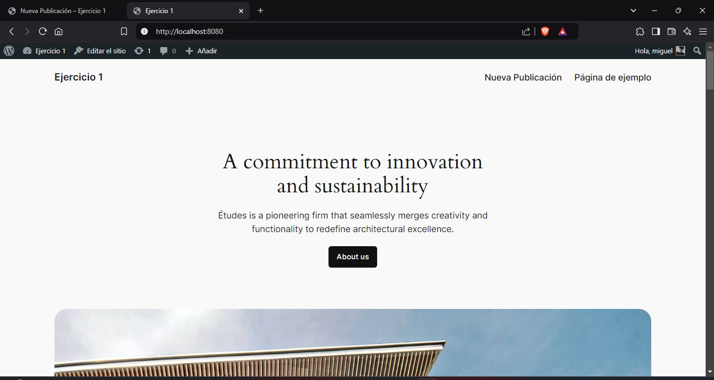

## Esquema para el ejercicio


### Crear la red
# COMPLETAR
```
docker network create net-wp -d bridge
```

### Crear el contenedor mysql a partir de la imagen mysql:8, configurar las variables de entorno necesarias
# COMPLETAR
```
docker run -d --name mysql -e MYSQL_ROOT_PASSWORD=admin123 -e MYSQL_DATABASE=mysql -e MYSQL_USER=miguel -e MYSQL_PASSWORD=admin --network net-wp mysql:8
```
### Crear el contenedor wordpress a partir de la imagen: wordpress, configurar las variables de entorno necesarias
# COMPLETAR
```
docker run -d --name wordpress -e WORDPRESS_DB_HOST=mysql:3306 -e WORDPRESS_DB_USER=miguel -e WORDPRESS_DB_PASSWORD=admin -e WORDPRESS_DB_NAME=mysql --network net-wp -p 8080:80 wordpress
```

De acuerdo con el trabajo realizado, en la el esquema de ejercicio el puerto a es 8080

Ingresar desde el navegador al wordpress y finalizar la configuración de instalación.
# COLOCAR UNA CAPTURA DE LA CONFIGURACIÓN

Desde el panel de admin: cambiar el tema y crear una nueva publicación.
Ingresar a: http://localhost:9300/ 
recordar que a es el puerto que usó para el mapeo con wordpress
# COLOCAR UNA CAPTURA DEL SITO EN DONDE SEA VISIBLE LA PUBLICACIÓN.

### Eliminar el contenedor wordpress
# COMPLETAR
docker rm -f wordpress

### Crear nuevamente el contenedor wordpress
Ingresar a: http://localhost:9300/ 
recordar que a es el puerto que usó para el mapeo con wordpress

### ¿Qué ha sucedido, qué puede observar?
# COMPLETAR
Se mantiene igual con los mismo cambios. Y la pagina publicada.


